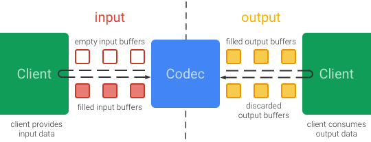
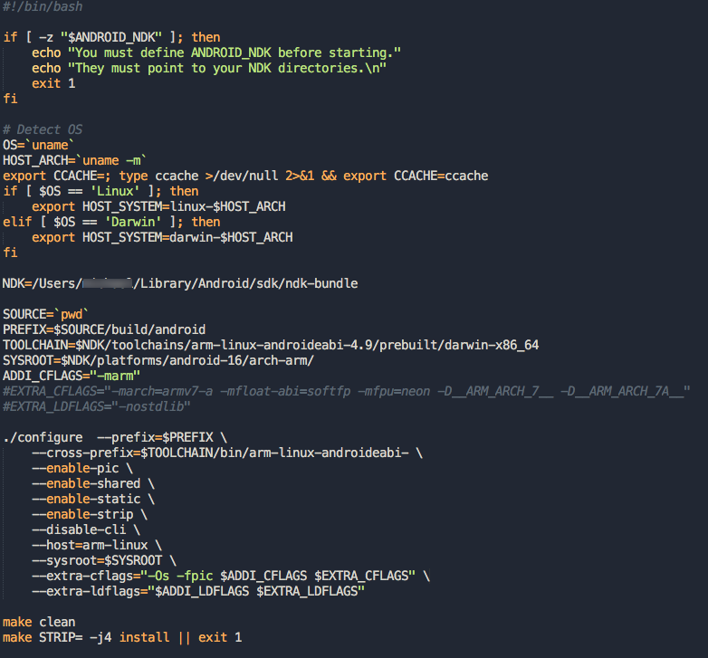
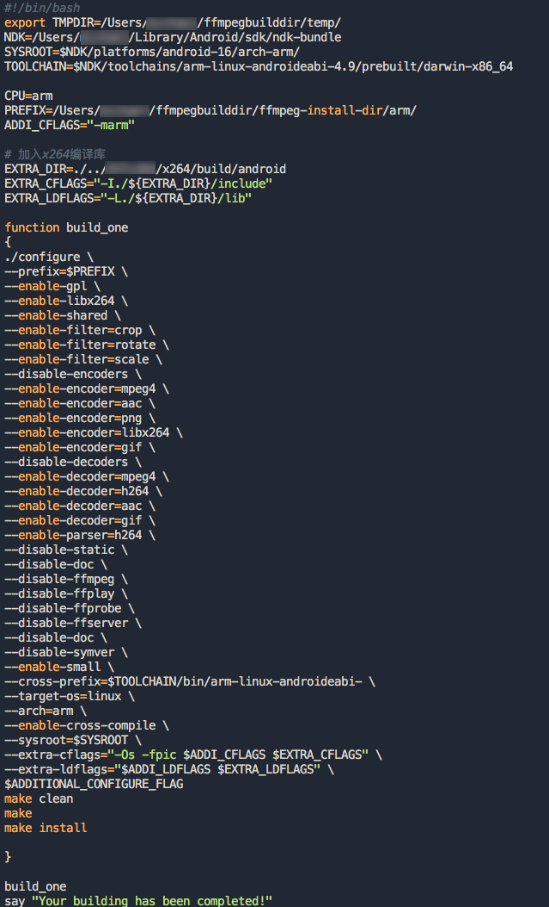
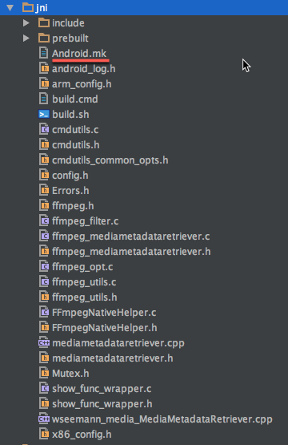
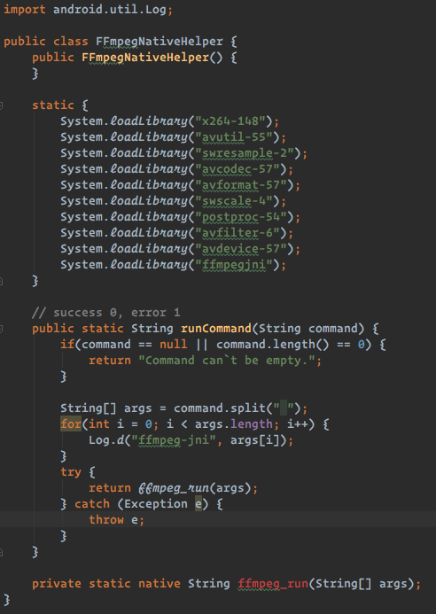
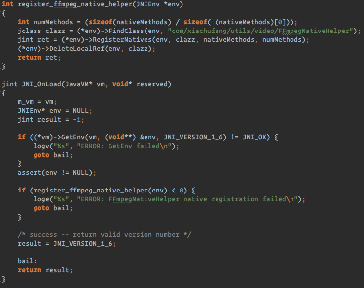
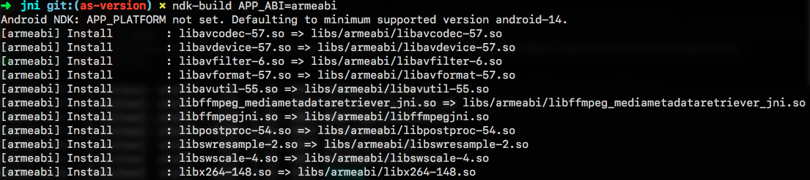
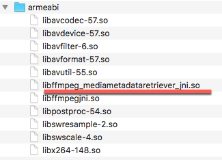

众所周知，Android 对涉及底层硬件的 API 控制力都比较弱，从其难用的 Camera/Camera2、MediaCodec 等 API 就可见一斑。

最近项目中有需要对视频进行编辑的需求，总体分析有如下技术上需要实现的点：

```
1. 需要支持视频尺寸裁剪，给出左上角和右下角的坐标后裁剪两个点描述的区域；

2. 需要支持帧预览，裁剪前需要向用户展示时间线上的预览图；

3. 需要支持截取视频，给出开始时间和结束时间后截取这两个时间点之间的视频段落。
```

---

## MediaCodec 方案

首先，按照 Android 官方的文档推荐，当然首推 MediaCodec。



1. **MediaCodec 尺寸裁减**

    首先用 inputBuffers 读取帧数据到 outputBuffers，如果需要使用 MediaCodec 裁减尺寸，按照上图 MediaCodec 的流程以及官方的文档，需要在处理 output buffer 时将每一帧的数据处理为 bitmap 然后根据左上角的坐标和右下角的坐标对图像进行裁减 [Bitmap.createBitmap][1]
实际上这样裁减的过程还是在利用 CPU 来进行裁减

2. **MediaCodec 取帧**

    使用[MediaMetadataRetriever](https://developer.android.com/reference/android/media/MediaMetadataRetriever.html)

3. **MediaCodec 截取**

    截取实际上在第一步的 output 就可以做了，因为 outputbuffer 里每一帧的数据就有时间戳信息，[MediaCodec.BufferInfo.presentationTimeUs](https://developer.android.com/reference/android/media/MediaCodec.BufferInfo.html#presentationTimeUs)

---

## MediaCodec 的问题

怎么样，看起来这套方案还是不错的，但是实际操作下来有几个严重的问题：

1. 首先不是所有设备的 DSP 芯片都支持你需要的 codec 对应的编码器，而且编码器支持特性相当有限：
具体参考[微信团队对 MediaCodec 编码器的研究](https://github.com/WeMobileDev/article/blob/master/%E5%BE%AE%E4%BF%A1Android%E8%A7%86%E9%A2%91%E7%BC%96%E7%A0%81%E7%88%AC%E8%BF%87%E7%9A%84%E9%82%A3%E4%BA%9B%E5%9D%91.md)
> 如果使用MediaCodec来编码H264视频流，对于H264格式来说，会有一些针对压缩率以及码率相关的视频质量设置，典型的诸如Profile(baseline, main, high)，Profile Level, Bitrate mode(CBR, CQ, VBR)，合理配置这些参数可以让我们在同等的码率下，获得更高的压缩率，从而提升视频的质量，Android也提供了对应的API进行设置，可以设置到MediaFormat中这些设置项:
>
> ```MediaFormat.KEY_BITRATE_MODE```
>
>```MediaFormat.KEY_PROFILE```
>
>```MediaFormat.KEY_LEVEL```
>
> 但问题是，对于Profile，Level, Bitrate mode这些设置，在大部分手机上都是不支持的，即使是设置了最终也不会生效，例如设置了Profile为high，最后出来的视频依然还会是Baseline....

2. 其次，MediaMetadataRetriever 实测也不太好用，在某些机型上会出现取不到帧的情况。
于是决定弃用 MediaCodec 转投如日中天的 FFmpeg。

---

## FFmpeg

FFmpeg 由于其丰富的 codec 插件，详细的文档说明，并且与其调试复杂量大的编解码代码(是的，用 MediaCodec 实现起来十分啰嗦和繁琐)还是不如调试一行 ffmpeg 命令来的简单。

利用 FFmpeg 做视频编辑大家一般都会去参考这个 [repo](https://github.com/WritingMinds/ffmpeg-android-java) ，但是他的 asset 里面的 ffmpeg 大小高达 18MB，即使压缩进 APK 包里也会达到 9MB。对 APK 大小敏感的开发者肯定颇有微词。
ffmpeg-android-java 的原理很简单，交叉编译好可执行的 ffmpeg 二进制文件放到 asset 里，安装后释放二进制文件到 /data/data/ 里，用 Shell command 的形式去执行这个文件，好处是没有任何依赖(依赖全打进二进制了)，稳定可靠(不需要动态加载)。
坏处就很明显了，因为是二进制文件，所以 size 会很大。

于是，果断放弃这种方式，转而编译 ffmpeg 的 so 库，动态加载然后执行命令。听起来不错，对不对？动态库的大小肯定比 ffmpeg-android-java 的 executable 要小多了，而且自己编译 ffmpeg 还能对其进行裁减。

---

## 交叉编译 FFmpeg 及 x264

相信很多开发者都会使用 ijkplayer，ijkplayer 底层也用到了 ffmpeg，ijk使用的是 so 库的形式，libffmpeg.so。所以最理想的状态是，重新编译一个公共的 libffmpeg.so，这个 libffmpeg.so 即有 ijk 需要的 decoders 和视频编辑模块需要的 encoders。但是一旦 ijk 或者 ffmpeg 有升级就会很麻烦，因为得重新编译一次 ffmpeg，而且还得 fork ijkplayer，然后每当 ijk 更新的时候将 ijkplayer master 合并到你 fork 分支，视频播放又是很常用的模块，很难做到“无痛”升级。

如果不动 ijk 的 ffmpeg，单独为视频编辑模块编译一个 ffmpeg.so ，与视频播放模块隔离开，这样就可以无痛升级 ijk 依赖 ffmpeg 的视频播放库了。但是，问题来了，如果存在两个 ffmpeg 的话不可避免的会存在冗余。所以编译视频编辑模块的 ffmpeg 时，要裁剪他的 encoders 和 decoders 尽量做到两个 ffmpeg 模块是正交的就 ok了。

交叉编译 FFmpeg 的过程就不赘述，网上有太多教程，这里简单记录一下编译的步骤：

1. 同步 x264 的 [repo](https://github.com/yixia/x264)，这里我选择的是 YIXIA INC 的 mirror.

2. 编写编译脚本：

    ```bash
    #!/bin/bash

    if [ -z "$ANDROID_NDK" ]; then
    	echo "You must define ANDROID_NDK before starting."
    	echo "They must point to your NDK directories.\n"
    	exit 1
    fi

    # Detect OS
    OS=`uname`
    HOST_ARCH=`uname -m`
    export CCACHE=; type ccache >/dev/null 2>&1 && export CCACHE=ccache
    if [ $OS == 'Linux' ]; then
    	export HOST_SYSTEM=linux-$HOST_ARCH
    elif [ $OS == 'Darwin' ]; then
    	export HOST_SYSTEM=darwin-$HOST_ARCH
    fi

    NDK=/Users/xxx/Library/Android/sdk/ndk-bundle

    SOURCE=`pwd`
    PREFIX=$SOURCE/build/android
    TOOLCHAIN=$NDK/toolchains/arm-linux-androideabi-4.9/prebuilt/darwin-x86_64
    SYSROOT=$NDK/platforms/android-16/arch-arm/
    ADDI_CFLAGS="-marm"
    #EXTRA_CFLAGS="-march=armv7-a -mfloat-abi=softfp -mfpu=neon -D__ARM_ARCH_7__ -D__ARM_ARCH_7A__"
    #EXTRA_LDFLAGS="-nostdlib"

    ./configure  --prefix=$PREFIX \
    	--cross-prefix=$TOOLCHAIN/bin/arm-linux-androideabi- \
    	--enable-pic \
    	--enable-shared \
    	--enable-static \
    	--enable-strip \
    	--disable-cli \
    	--host=arm-linux \
    	--sysroot=$SYSROOT \
    	--extra-cflags="-Os -fpic $ADDI_CFLAGS $EXTRA_CFLAGS" \
    	--extra-ldflags="$ADDI_LDFLAGS $EXTRA_LDFLAGS"

    make clean
    make STRIP= -j4 install || exit 1
    ```

    


3. 找到x264 repo 的根目录下的 configure 文件，找到 `echo "SONAME=libx264.so.$API" >> config.mak` 改为 `echo "SONAME=libx264-$API.so" >> config.mak`

4. 执行编译脚本进行编译，结果在会在 `build/` 文件夹下

5. 接下来编译 FFmpeg, 先同步 ffmpeg 的 [repo](https://github.com/FFmpeg/FFmpeg)

6. 编写编译脚本：

    ```
    #!/bin/bash
    export TMPDIR=/Users/xxx/ffmpegbuilddir/temp/
    NDK=/Users/xxx/Library/Android/sdk/ndk-bundle
    SYSROOT=$NDK/platforms/android-16/arch-arm/
    TOOLCHAIN=$NDK/toolchains/arm-linux-androideabi-4.9/prebuilt/darwin-x86_64

    CPU=arm
    PREFIX=/Users/xxx/ffmpegbuilddir/ffmpeg-install-dir/arm/
    ADDI_CFLAGS="-marm"

    # 加入x264编译库
    EXTRA_DIR=./../path/to/your/x264/repo/build/android
    EXTRA_CFLAGS="-I./${EXTRA_DIR}/include"
    EXTRA_LDFLAGS="-L./${EXTRA_DIR}/lib"

    function build_one
    {
    ./configure \
    --prefix=$PREFIX \
    --enable-gpl \
    --enable-libx264 \
    --enable-shared \
    --enable-filter=crop \
    --enable-filter=rotate \
    --enable-filter=scale \
    --disable-encoders \
    --enable-encoder=mpeg4 \
    --enable-encoder=aac \
    --enable-encoder=png \
    --enable-encoder=libx264 \
    --enable-encoder=gif \
    --disable-decoders \
    --enable-decoder=mpeg4 \
    --enable-decoder=h264 \
    --enable-decoder=aac \
    --enable-decoder=gif \
    --enable-parser=h264 \
    --disable-static \
    --disable-doc \
    --disable-ffmpeg \
    --disable-ffplay \
    --disable-ffprobe \
    --disable-ffserver \
    --disable-doc \
    --disable-symver \
    --enable-small \
    --cross-prefix=$TOOLCHAIN/bin/arm-linux-androideabi- \
    --target-os=linux \
    --arch=arm \
    --enable-cross-compile \
    --sysroot=$SYSROOT \
    --extra-cflags="-Os -fpic $ADDI_CFLAGS $EXTRA_CFLAGS" \
    --extra-ldflags="$ADDI_LDFLAGS $EXTRA_LDFLAGS" \
    $ADDITIONAL_CONFIGURE_FLAG
    make clean
    make
    make install

    }

    build_one
    say "Your building has been completed!"
    ```

    

7. 执行编译脚本，编译结果会在 /Users/xxx/ffmpegbuilddir/ffmpeg-install-dir/arm/ 目录下

8. 到此，你已经拥有了能在 arm 平台上 load 的 so 文件

---

## 编写 jni 来调用 ffmpeg

在上面的编译脚本中，我们考虑到 so 的输出大小，configure 中有这么一行 `--disable-ffmpeg`，意为不编译 ffmpeg 的可执行文件，这样我们就没有 ffmpeg 的执行入口，相当于没有 `main()`函数。所以，我们需要为这些 so 文件编写一个命令执行的入口，这方面也有超多的教程，过程就不深究了，同样这里也只记录一下编译步骤：

0. 在你的 Android Studio 工程里新建一个目录，例如： jni/

1. 将 ffmpeg repo 中的 ffmpeg.c、ffmpeg.h、FFmpegNativeHelper.c、cmdutils.c、ffmpeg_opt.c、ffmpeg_filter.c、show_func_wrapper.c 拷贝到 jni

2. 编写 makefile:

    ```makefile
    ifeq ($(APP_ABI), x86)
    LIB_NAME_PLUS := x86
    else
    LIB_NAME_PLUS := armeabi
    endif

    LOCAL_PATH:= $(call my-dir)

    include $(CLEAR_VARS)
    LOCAL_MODULE := x264-prebuilt-$(LIB_NAME_PLUS)
    LOCAL_SRC_FILES := prebuilt/$(LIB_NAME_PLUS)/libx264-148.so
    include $(PREBUILT_SHARED_LIBRARY)

    include $(CLEAR_VARS)
    LOCAL_MODULE:= avcodec-prebuilt-$(LIB_NAME_PLUS)
    LOCAL_SRC_FILES:= prebuilt/$(LIB_NAME_PLUS)/libavcodec-57.so
    include $(PREBUILT_SHARED_LIBRARY)

    include $(CLEAR_VARS)
    LOCAL_MODULE:= avdevice-prebuilt-$(LIB_NAME_PLUS)
    LOCAL_SRC_FILES:= prebuilt/$(LIB_NAME_PLUS)/libavdevice-57.so
    include $(PREBUILT_SHARED_LIBRARY)

    include $(CLEAR_VARS)
    LOCAL_MODULE:= avfilter-prebuilt-$(LIB_NAME_PLUS)
    LOCAL_SRC_FILES:= prebuilt/$(LIB_NAME_PLUS)/libavfilter-6.so
    include $(PREBUILT_SHARED_LIBRARY)

    include $(CLEAR_VARS)
    LOCAL_MODULE:= avformat-prebuilt-$(LIB_NAME_PLUS)
    LOCAL_SRC_FILES:= prebuilt/$(LIB_NAME_PLUS)/libavformat-57.so
    include $(PREBUILT_SHARED_LIBRARY)

    include $(CLEAR_VARS)
    LOCAL_MODULE :=  avutil-prebuilt-$(LIB_NAME_PLUS)
    LOCAL_SRC_FILES := prebuilt/$(LIB_NAME_PLUS)/libavutil-55.so
    include $(PREBUILT_SHARED_LIBRARY)

    include $(CLEAR_VARS)
    LOCAL_MODULE := swresample-prebuilt-$(LIB_NAME_PLUS)
    LOCAL_SRC_FILES := prebuilt/$(LIB_NAME_PLUS)/libswresample-2.so
    include $(PREBUILT_SHARED_LIBRARY)

    include $(CLEAR_VARS)
    LOCAL_MODULE := swscale-prebuilt-$(LIB_NAME_PLUS)
    LOCAL_SRC_FILES := prebuilt/$(LIB_NAME_PLUS)/libswscale-4.so
    include $(PREBUILT_SHARED_LIBRARY)

    include $(CLEAR_VARS)
    LOCAL_MODULE := postproc-prebuilt-$(LIB_NAME_PLUS)
    LOCAL_SRC_FILES := prebuilt/$(LIB_NAME_PLUS)/libpostproc-54.so
    include $(PREBUILT_SHARED_LIBRARY)

    include $(CLEAR_VARS)

    LOCAL_MODULE := libffmpegjni

    ifeq ($(APP_ABI), x86)
    TARGET_ARCH:=x86
    TARGET_ARCH_ABI:=x86
    else
    LOCAL_ARM_MODE := arm
    endif

    LOCAL_SRC_FILES := FFmpegNativeHelper.c \
                       cmdutils.c \
                       ffmpeg_opt.c \
                       ffmpeg_filter.c \
                       show_func_wrapper.c

    LOCAL_LDLIBS := -L$(SYSROOT)/usr/lib -llog -lz

    LOCAL_SHARED_LIBRARIES:= avcodec-prebuilt-$(LIB_NAME_PLUS) \
                             avdevice-prebuilt-$(LIB_NAME_PLUS) \
                             avfilter-prebuilt-$(LIB_NAME_PLUS) \
                             avformat-prebuilt-$(LIB_NAME_PLUS) \
                             avutil-prebuilt-$(LIB_NAME_PLUS) \
                             swresample-prebuilt-$(LIB_NAME_PLUS) \
                             swscale-prebuilt-$(LIB_NAME_PLUS) \
                             postproc-prebuilt-$(LIB_NAME_PLUS) \
                             x264-prebuilt-$(LIB_NAME_PLUS)

    LOCAL_C_INCLUDES += -L$(SYSROOT)/usr/include
    LOCAL_C_INCLUDES += $(LOCAL_PATH)/include

    ifeq ($(APP_ABI), x86)
    LOCAL_CFLAGS := -DUSE_X86_CONFIG
    else
    LOCAL_CFLAGS := -DUSE_ARM_CONFIG
    endif

    include $(BUILD_SHARED_LIBRARY)
    ```

    


3. 编写 java 代码，声明 Java native method

    

3. 修改 ffmpeg.c 文件，绑定 jni 方法名与 ffmpeg.c 的方法名

    

3. 在 jni 目录下执行 `ndk-build APP_ABI=armeabi`


    


4. 在 libs/armeabi 目录下得到 libffmpegjni.so

5. 到这里，你已经拥有了可以动态 load 的 so 库，并且可以执行 ffmpeg command 了！

---

## 集成 FFmpegMediaMetadataRetriever

相信很多开发者对这个库都不会陌生[FFmpegMediaMetadataRetriever](https://github.com/wseemann/FFmpegMediaMetadataRetriever)，正如上面所说，原生的 MediaMetadataRetriever 不太好用，这个开源库被我们用来取预览帧：给出时间点，返回 bitmap。

然而，这个库引进来后，聪明的你应该发现了他也编译了一个 ffmpeg 放在了 aar 中，大小约为4MB。

其实，上面步骤走完后，你应该立即想到“可以直接复用已经编译好的 ffmpeg”，安装包立即节约4MB！

同样的这里也只记录步骤：

1. 将 FFmpegMediaMetadataRetriever repo 下 `FFmpegMediaMetadataRetriever/gradle/fmmr-library/library/src/main/jni/metadata` 的 .c 、.h、.cpp 文件都拷贝到上述的 jni 文件夹中

2. 打开上面章节我们编写的 makefile，添加如下代码：

    ```makefile
    include $(CLEAR_VARS)
    LOCAL_MODULE  := ffmpeg_mediametadataretriever_jni

    ifeq ($(APP_ABI), x86)
    TARGET_ARCH:=x86
    TARGET_ARCH_ABI:=x86
    else
    LOCAL_ARM_MODE := arm
    endif

    LOCAL_SRC_FILES  :=  wseemann_media_MediaMetadataRetriever.cpp \
                         mediametadataretriever.cpp \
                         ffmpeg_mediametadataretriever.c \
                         ffmpeg_utils.c

    LOCAL_LDLIBS := -L$(SYSROOT)/usr/lib -llog -lz
    LOCAL_LDLIBS += -landroid
    LOCAL_LDLIBS += -ljnigraphics

    LOCAL_SHARED_LIBRARIES:= avcodec-prebuilt-$(LIB_NAME_PLUS) \
                             avdevice-prebuilt-$(LIB_NAME_PLUS) \
                             avfilter-prebuilt-$(LIB_NAME_PLUS) \
                             avformat-prebuilt-$(LIB_NAME_PLUS) \
                             avutil-prebuilt-$(LIB_NAME_PLUS) \
                             swresample-prebuilt-$(LIB_NAME_PLUS) \
                             swscale-prebuilt-$(LIB_NAME_PLUS) \
                             postproc-prebuilt-$(LIB_NAME_PLUS) \
                             x264-prebuilt-$(LIB_NAME_PLUS)

    LOCAL_C_INCLUDES += -L$(SYSROOT)/usr/include
    LOCAL_C_INCLUDES += $(LOCAL_PATH)/include

    ifeq ($(APP_ABI), x86)
    LOCAL_CFLAGS := -DUSE_X86_CONFIG
    else
    LOCAL_CFLAGS := -DUSE_ARM_CONFIG
    endif

    include $(BUILD_SHARED_LIBRARY)
    ```

3. 重新执行 `ndk-build APP_ABI=armeabi` ，将在 `libs/armeabi` 下得到 lib ffmpeg_mediametadataretriever_jni.so

    

4. 将 FFmpegMediaMetadataRetriever repo 中 的 Java 类`FFmpegMediaMetadataRetriever.java`拷贝到你的项目中，注意要改一下 so load 的过程：

    

5. 到这里，你已经或得了可以运行的 FFmpegMediaMetadataRetriever，并且复用了用于视频编辑模块的 ffmpeg

---

## 后续

如果你需要任何帮助，可以参考我的开源库[zhoulujue/ffmpeg-commands-executor-library](https://github.com/zhoulujue/ffmpeg-commands-executor-library)， fork 的 [dxjia/ffmpeg-commands-executor-library](https://github.com/dxjia/ffmpeg-commands-executor-library) 仓库。

自己完全控制 ffmpeg 有一个很大的好处，就是可以根据需求的变化来调整所引入的 ffmpeg codec 插件。
例如，需要增加对 gif 编辑的支持，只需要添加一个 encoder 和 decoder 就 OK 了。

[1]: https://developer.android.com/reference/android/graphics/Bitmap.html#createBitmap%28android.graphics.Bitmap,%20int,%20int,%20int,%20int%29

