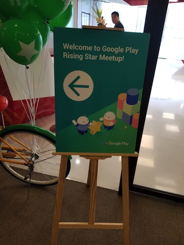
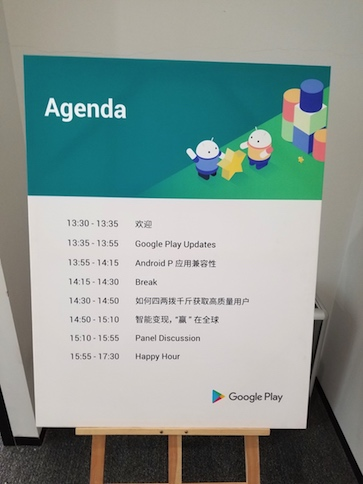
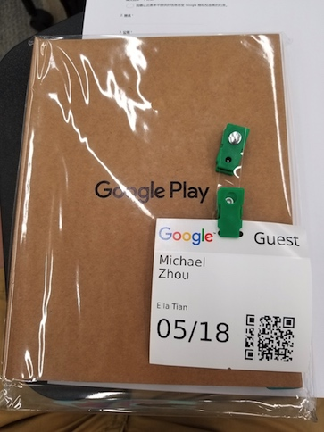

17号收到谷歌 Maya 同学的邮件邀请去参加会议，我全然忘了什么时候被推荐去参加 Google 的组织的 Rising Star 线下聚会。其主要目的是将一些创业公司召集起来，鼓励大家做出海应用、同步 I/O 上的技术、产品等等。相当于是一个谷歌与创业公司的一个双向沟通。

下午12:30出发，目的地在一个名为“融科资讯中心”的大厦里，进去后感觉很高大上，电梯间也有很明显的 Google 风格的一些装饰，突然感觉是曾相识，我才想起来以前在搜狗上班的时候，同方大厦的那几层也是这样的装修风格。也不知道是谁抄袭谁哈~

---

茶歇时遇到了一个做游戏出海的人，叫徐双。（后来翻出名片才知道公司名字叫 EnjoyGame）这个人很热情，主动问起我是做什么的，我告诉她我是下厨房的人后，她欣喜的掏出手机打开她的下厨房 App 告诉我她买了一些电子书，并且经常在下厨房上找菜谱。
探讨了下厨房的一些商业模式，盈利点等等，由于我涉及的比较少，我只能说个大概，但是说到下厨房产品本身相关的东西，我能讲的头头是道，像首页是怎么演进的我们对用户行为的一些思考和判断，于是前排的人也转过身来听我讲，自己在发光的感觉真的很不错。

我也向徐双同学请教了一下出海应用的现状，发现真是闷声挣大钱的一个行业！原来国内做出海游戏已经非常挣钱了，而且套路很多，听下来大体是：做爆款 -> 买流量 -> 盯转化 -> 收割流量 -> 做下一个...这样循环往复。原来 Google Play /AdMob 也提供了成熟的流量购买方式，她们还会把 Google 的数据和其他广告平台进行对比，介于很多术语不懂，所以后面很多东西我其实都没有听太懂...

---

原来认识新的朋友没有我想象的那样耗费认知力，感觉不错，可能要保持这样的朋友关系可能需要更多的付出而我不太擅长吧。

很惊喜的是，遇到了之前的朋友陈卓，他今天来做 Android P 的 session，上次遇见他还是在上海的 Google 开发者大会，彼时他太忙没有聊太多，今天准备叙叙旧结果在茶歇时发现他已经早走了。也算是遗憾吧。想起刚认识，他还是售前工程师，现在已经成了`技术推广工程师`，**每天学习最新的技术并向全世界推广，应该是最幸福的工程师了吧！**

在不同的场合都和 Google 中国的员工有过一些交流，今天也听了很多 Speaker 的 session, 总体感觉是这些人好像和我们都是一样，没有那么的“高大上”，大家都是在很务实地完成一些事情，执行力很高。包括之前去亚马逊去面试的时候，也是相同的感觉，可能优秀的公司都是有务实这个优点吧。

第一次有了，Google 的中国员工“不过如此，我也可以”的想法，不知道是好是坏哈哈哈。

