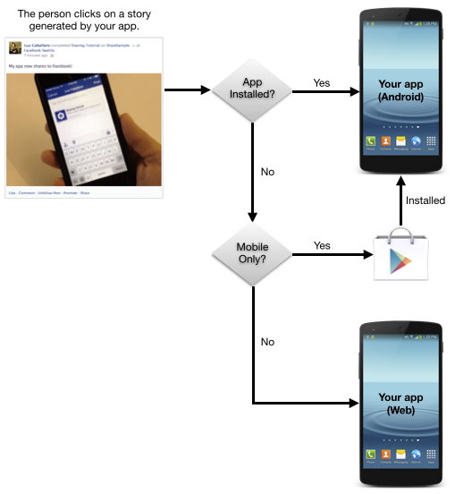
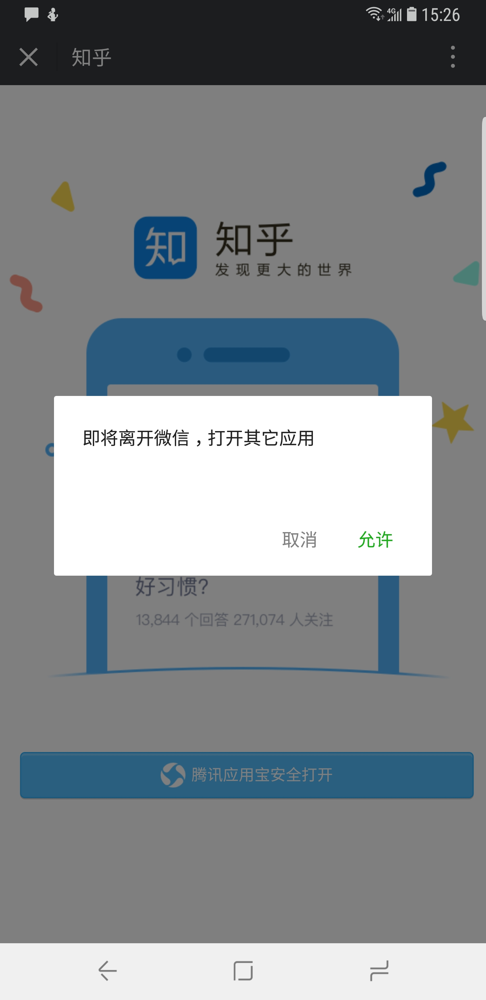

如果你的产品向用户提供网页服务，像 Web 页面或者为移动设备设计的 Html5 页面，那么我猜你
一定会鼓励用户将这些内容分享到其他平台，或者通过信息邮件分享。

一般来说产品经理会用各种机制来鼓励用户主动完成分享，有的产品会对完成分享的用户奖励，
比如积分、优惠券等。*分享*的实质是基于用户关系的传播，让更多人接触到你的产品。这些看到
分享链接或者页面的人，如果产生一次点击，你需要尽一切可能把他转化成你的用户。提高点击链接
的效果，也就提高了产品的*分享转化率*。

所以本文主要解决的问题其实是**如何在 Android 上尽可能提高`分享转化率`**。

# 基础设施: URL 路由

这是后续步骤的基础，没有这个基础，后面说道的很多事情没有办法完成。
URL路由指的是你的 App 里的产品页面都需要能用户 URL 跳转。Github 上有非常多非常优秀的
URL 路由，像阿里巴巴技术团队的[ARouter](https://github.com/alibaba/ARouter)。
你只需要简单配置，加上注解，就可以很快的搭建自己的 URL 路由框架。

下面我们简单介绍一下基本原理。

举个例子，一个新闻 App 提供"新闻详情页"、"新闻专题页"、"新闻讨论页" 这个3个功能模块。
我们先假设我们要处理的 App 的包名为 `com.zhoulujue.news`, 所以这些功能模块的连接
看起来应该是这样：
```
指向id=123456的新闻详情页：http://news.zhoulujue.com/article/123456/
指向id=123457的新闻专题页：http://news.zhoulujue.com/story/123457/
指向id=123456的新闻讨论页：http://news.zhoulujue.com/article/123456/comments/
```
再假设这些页面的类名分别为：
```
新闻详情页：ArticleActivity
新闻专题页：StoryActivity
新闻讨论页：CommentsActivity
```
所以我们需要一个管理中心，完成两件事情：

1. 将外界传递进来的 URL，分发给各个 Activity 来处理；
2. 管理 URL 路径和 Activity 的对应关系。

为了统一入口，我们创建一个入口 Activity: `RouterActivty`，它用来向系统声明 App 能
打开哪些链接，同时接受外界传递过来的 URL。首先我们在 Manifest 里声明它：

```xml
<activity
    android:name=".RouterActivty"
    android:theme="@android:style/Theme.Translucent.N
    <intent-filter android:autoVerify="true">
        <action android:name="android.intent.acti
        <category android:name="android.intent.category.DEFAULT" />
        <category android:name="android.intent.category.BR
        <data
            android:host="news.zhoulujue.com"
            android:pathPattern="/.*"
            android:scheme="http" />
        <data
            android:host="news.zhoulujue.com"
            android:pathPattern="/.*"
            android:scheme="https" />
    </intent-filter>
</activity>
```
上面的声明表示，RouterActivty 可以打开所有域名为news.zhoulujue.com 的 https/http
链接。
这个 RouterActivty 在收到 http://news.zhoulujue.com/article/123456/ 后，需要
负责将 /article/123456/ 解析出来，根据*对应关系*找到`ArticleActivity`，唤起它并且
把`123456`这个 id 作为参数传递给`ArticleActivity`。

常见的 Router 框架通过在 Activity 的类名上添加注解来管理对应关系：
```
@Route(path = "/acticel/")
public class ArticleActivity extend Activity {
    ...
}
```
实际上它在处理这个注解的时候生成了一个建造者模式里的 builder，然后向*管理中心*注册，说
自己(ArticleActivity)能处理`/acticel/xxx`的子域名。

# Scheme 的选择很重要：URL Scheme 唤醒
上面简述原理的时候说道了 Manifest 的声明，我们只声明了 `android:scheme="http"`
和 `android:scheme="http"` , 但是实际上很多 App 还会用特定 `scheme` 的方式来唤起
App，例如在 iOS 早期没有 UniversalLink 的时候，大家这样来唤起。

像淘宝就会用 `tbopen`
的 scheme，例如 `tbopen://item.taobao.com/item.htm?id=xxxx`，当你在网页点击
链接以后，页面会创建一个隐藏的 iframe，用它来打开自定义 scheme 的 URL，浏览器无法
响应时向系统发送一个 Action 为 `android.intent.action.VIEW`、Data 为
 `tbopen://item.taobao.com/item.htm?id=xxxx` 的 Intent，如果 App 已经按照
上述章节改造，那么系统将唤起 RouterActivity 并将 Intent 传递过去。
所以问题就来了：**如何选取一个 URL Scheme 使得*浏览器无法响应***，所以你的 scheme
最好满足以下两个条件：
     1. 区别于其他应用：唯一性
     2. 区别于浏览器已经能处理的 scheme：特殊性

在我们上述假设的新闻 App 里，我们可以定义 scheme 为 `zljnews`，那么在 URL Scheme
发送的 URL 将会是这样：
```
指向id=123456的新闻详情页：zljnews://news.zhoulujue.com/article/123456/
指向id=123457的新闻专题页：zljnews://news.zhoulujue.com/story/123457/
指向id=123456的新闻讨论页：zljnews://news.zhoulujue.com/article/123456/comments/
```
为了避免某些应用会预处理 scheme 和 host，我们还需要将 URL Scheme 的 Host 也做相应
更改：
```
指向id=123456的新闻详情页：zljnews://zljnews/article/123456/
指向id=123457的新闻专题页：zljnews://zljnews/story/123457/
指向id=123456的新闻讨论页：zljnews://zljnews/article/123456/comments/
```
这样的我们的 Manifest 里 RouterActivity 的声明要改为：
```xml
<activity
    android:name=".RouterActivty"
    android:theme="@android:style/Theme.Translucent.N
    <intent-filter android:autoVerify="true">
        <action android:name="android.intent.acti
        <category android:name="android.intent.category.DEFAULT" />
        <category android:name="android.intent.category.BR
        <data
            android:host="news.zhoulujue.com"
            android:pathPattern="/.*"
            android:scheme="http" />
        <data
            android:host="news.zhoulujue.com"
            android:pathPattern="/.*"
            android:scheme="https" />
    </int
    <intent-filter>
        <action android:name="android.intent.acti
        <category android:name="android.intent.category.DEFAULT" />
        <category android:name="android.intent.category.BR
        <data android:scheme="zljnews" />
        <data android:host="zljnews" />
        <data android:pathPattern="/.*" />
    </intent-filter>
</activity>
```

# App Links 与 Universal Links，来自官方的方式
我们假设一个用例：用户在印象笔记里写了一篇笔记，笔记里有一个链接：
`http://news.zhoulujue.com/article/123456/`。
那么问题来了：用户点击以后，将会发生什么？

答案是：很大的可能是系统弹出一个对话框，列出若干个 App，问你想用哪一个打开。

这样体验其实不够好，因为用户路径变长了，**转化率**将下降。所以我们应该尽可能去掉这个
对话框，其实上述章节说到了一个方法：将 `http://news.zhoulujue.com/article/123456/`
改为 `zljnews://zljnews/article/123456/`，原理是我们选取了看起来"唯一性"的 scheme，
但是如果用户没有安装你的 App，这个体验就相当糟糕了，用户在点击以后将没有任何反应。

此时就需要 AppLinks 和 UniversalLinks 了，一言以蔽之，就是域名持有者向系统证明自己
拥有 `news.zhoulujue.com` 这个域名并且 App 属于自己，这样系统就会直接将 App 唤起
并把 intent 传递给 App。

如何配置 AppLinks 就不在赘述了，参考[官方的教程](https://developer.android.com/training/app-links/index.html)。

# App Links 实现的另一种方式
Facebook 在2014年的F8开发者大会上公布了 AppLinks 协议，在Android 的 AppLinks之前(Google I/O 15)，
也是一种可行的“链接跳转 App”的方式。
这里也不在赘述细节，可以参考 Facebook 官方的介绍来实现，也特别简单，[Facebook AppLinks](https://developers.facebook.com/docs/applinks)


# 非自己的代码怎么办
上面说了很多在网页中唤醒 App 的方式，但是这些都是建立在我们可以改页面 JS 等代码的前提下，
如果页面由第三方提供，举个例子，由广告主提供，表现方式是广告主提供一个落地页放在你的 App 里，
推动第三方去按照你的要求去改动他们的代码，可能比较困难，但是如果只是修改一下跳转链接就可以达到
唤起 App 的效果，这样性价比就比较高了。这个时候就需要 chrome 推荐的 intent scheme 了：

```xml
<a href="intent://zljnews/recipe/100390954#Intent;scheme=zljnews;package=com.zhoulujue.news;end"> Intent scheme </a>
```

如代码所示，scheme填写的是我们上面假设的 scheme：`zljnews`，保持一致。
package 填写 App 包名：`com.zhoulujue.news`，参考[Chrome官方 Intent 编写规范](https://developer.chrome.com/multidevice/android/intents)

# 微信里怎么办
总所周知，微信是限制唤起 App 的行为的，坊间流传着各种微信唤起的 hack，但总是不知道什么时候就被封禁了，这里介绍
微信官方的*正规*搞法：微下载链接：




如上图，知乎就使用了微下载来向知乎的 App 导流，这种方式 Android iOS 都是通用的，具体实现方式参考腾讯微信官方的
[文档](http://wiki.open.qq.com/index.php?title=mobile/%E5%BA%94%E7%94%A8%E5%AE%9D%E5%BE%AE%E4%B8%8B%E8%BD%BD)。

# 优化1：从网页到 App 的无缝体验
假设一个场景，用户访问 `http://news.zhoulujue.com` 阅读新闻时，被推荐下载了 App，此时安装完毕后打开 App后，最好
的体验当然是帮用户打开他没有看完新闻，直接跳转到刚刚在网页版阅读的文章。
最佳实践是：在用户点击下载时，把当前页面的 URL 写到 APK 文件的 ZIP 文件头里，待用户下载安装完毕后，启动时去读取这个
URL，然后结合上面说到过的 Router，路由到新闻详情页。下面跟我来一步一步实现吧。

## 在网页上下载APK时：将路径写如 APK 的 ZIP 文件头里

将下面的 Java 代码保存为 `WriteAPK.java` 并用 javac 编译好。

```java
import java.io.ByteArrayOutputStream;
import java.io.File;
import java.io.IOException;
import java.io.RandomAccessFile;
import java.nio.ByteBuffer;
import java.nio.ByteOrder;
import java.util.zip.ZipFile;

/**
 * Created by michael on 16/9/8.
 */
public class WriteApk {

    public static void main(String[] args) {
        for (int i = 0; i < args.length; i++) {
            System.out.println(args[i]);
        }
        if (args.length < 2) {
            System.out.println("Wrong parameters! Usage : WriteApk path comment\n");
        }
        String path = args[0];
        String comment = args[1];
        writeApk(new File(path), comment);
        System.out.println("Complete! File lies in " + path);
        try {
            ZipFile zipFile = new ZipFile(new File(path));
            System.out.println("Zip file comment = " + zipFile.getComment());
        } catch(IOException e) {
            e.printStackTrace();
            System.out.println("Zip file comment read failed!");
        }
    }

    public static void writeApk(File file, String comment) {
        ZipFile zipFile = null;
        ByteArrayOutputStream outputStream = null;
        RandomAccessFile accessFile = null;
        try {
            zipFile = new ZipFile(file);
            String zipComment = zipFile.getComment();
            if (zipComment != null) {
                return;
            }

            byte[] byteComment = comment.getBytes();
            outputStream = new ByteArrayOutputStream();

            outputStream.write(byteComment);
            outputStream.write(short2Stream((short) byteComment.length));

            byte[] data = outputStream.toByteArray();

            accessFile = new RandomAccessFile(file, "rw");
            accessFile.seek(file.length() - 2);
            accessFile.write(short2Stream((short) data.length));
            accessFile.write(data);
        } catch (IOException e) {
            e.printStackTrace();
        } finally {
            try {
                if (zipFile != null) {
                    zipFile.close();
                }
                if (outputStream != null) {
                    outputStream.close();
                }
                if (accessFile != null) {
                    accessFile.close();
                }
            } catch (Exception e) {

            }

        }
    }

    /**
     * 字节数组转换成short（小端序）
     */
    private static byte[] short2Stream(short data) {
        ByteBuffer buffer = ByteBuffer.allocate(2);
        buffer.order(ByteOrder.LITTLE_ENDIAN);
        buffer.putShort(data);
        buffer.flip();
        return buffer.array();
    }
}
```

然后使用下面的命令对 APK 写入 URL：

```bash
$java -jar WriteAPK /path/to/your/APK http://news.zhoulujue.com/article/12345/
```

## 用户首次打开时：读取 URL 并打开
在 App 首次打开的时候读取 ZIP 文件头里你写入的 URL，读取代码如下：

```java
public static String getUnfinishedURL(Context context) {
    //获取缓存的 APK 文件
    File file = new File(context.getPackageCodePath());
    byte[] bytes;
    RandomAccessFile accessFile = null;
    // 从指定的位置找到 WriteAPK.java 写入的信息
    try {
        accessFile = new RandomAccessFile(file, "r");
        long index = accessFile.length();
        bytes = new byte[2];
        index = index - bytes.length;
        accessFile.seek(index);
        accessFile.readFully(bytes);
        int contentLength = stream2Short(bytes, 0);
        bytes = new byte[contentLength];
        index = index - bytes.length;
        accessFile.seek(index);
        accessFile.readFully(bytes);
        return new String(bytes, "utf-8");
    } catch (IOException e) {
        e.printStackTrace();
    } finally {
        if (accessFile != null) {
            try {
                accessFile.close();
            } catch (IOException ignored) {
                ignored.printStackTrace();
            }
        }
    }
    return null;    
}
```
将`getUnfinishedURL`返回值交给 Router 去处理，从而将用户导向没有阅读完毕的新闻详情页。

# 有控制的允许流量的导出
上面的内容都是在讲如何尽可能地把用户导进 App 里来，从另外一个角度，为了提高用户转化率我们要降低用户的**跳出率**，
也就是说尽量避免用户从我们的 App 里被带跑了。很多情况下，如果我们运营一个 UGC 的社区，我们无法控制用户创建内容的时候
会填写哪些 URL，当然作为一个开放的平台我们肯定希望用户能够更高地利用各种工具将他们所专注的任务完成。但是如果平台出现了
一些人不受限制的发广告，或者利用你的平台运营竞争对手的产品，这种方式对成长中的产品打击有可能将是毁灭性的。
最佳实践：在服务器维护一个白名单，这个白名单中被允许的域名将被允许唤醒，否则拦截。

而这个拦截最好的方式是在WebView里，因为大多数跳转代码都在 URL 指向的落地页里。所以我们需要这样定义`WebView`的`WebViewClient`

```java
public class ControlledWebViewClient extends WebViewClient {

    @Override
    public boolean shouldOverrideUrlLoading(WebView view, String url) {
        Context context =  view.getContext();
        try {
            String host = Uri.parse(url.getOriginalUrl()).getHost();
            if (!isHostInWhiteList(host)) {
                return false;
            }
            
            String scheme = Uri.parse(url).getScheme();
            if (!TextUtils.isEmpty(scheme) && !scheme.equals("http") && !scheme.equals("https")) {
                Intent intent = new Intent(Intent.ACTION_VIEW, Uri.parse(url));
                intent.addFlags(Intent.FLAG_ACTIVITY_SINGLE_TOP);
                intent.addFlags(Intent.FLAG_ACTIVITY_NEW_TASK);
                context.getApplicationContext().startActivity(intent);
                return true;
            }
        } catch (Throwable t) {
            t.printStackTrace();
        }

        return false;
    }

    private boolean isHostInWhiteList(String) {
        // 查询白名单，是否在白名单里
        ...
    }
}
```
为了尽可能获取正确的 Host，请注意在上面第7行代码里，使用的是`url.getOriginalUrl()`

---

好了，App 里面利用链接跳来跳去的事情基本上就讲完了，希望对你有帮助。如果你还有什么建议，可以通过扫描下面的二维码联系我，或者在下面留言哦~


