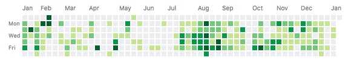
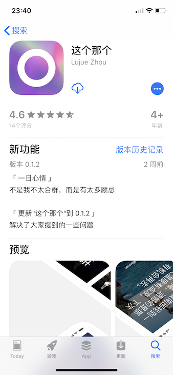
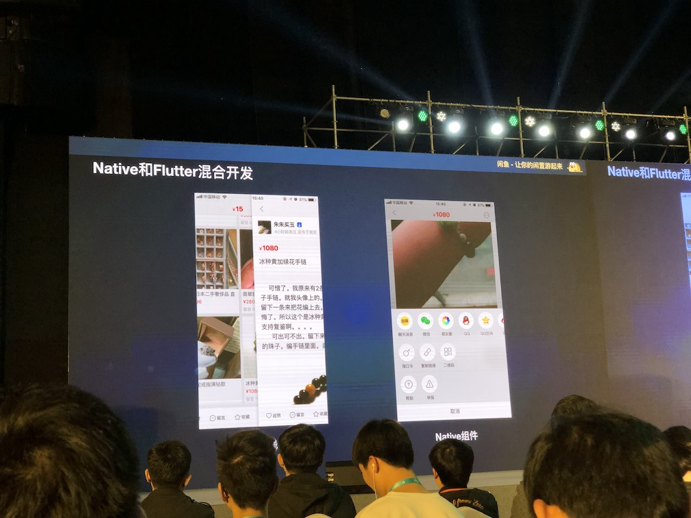
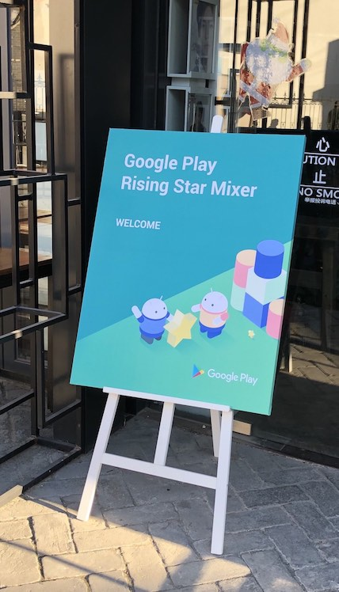
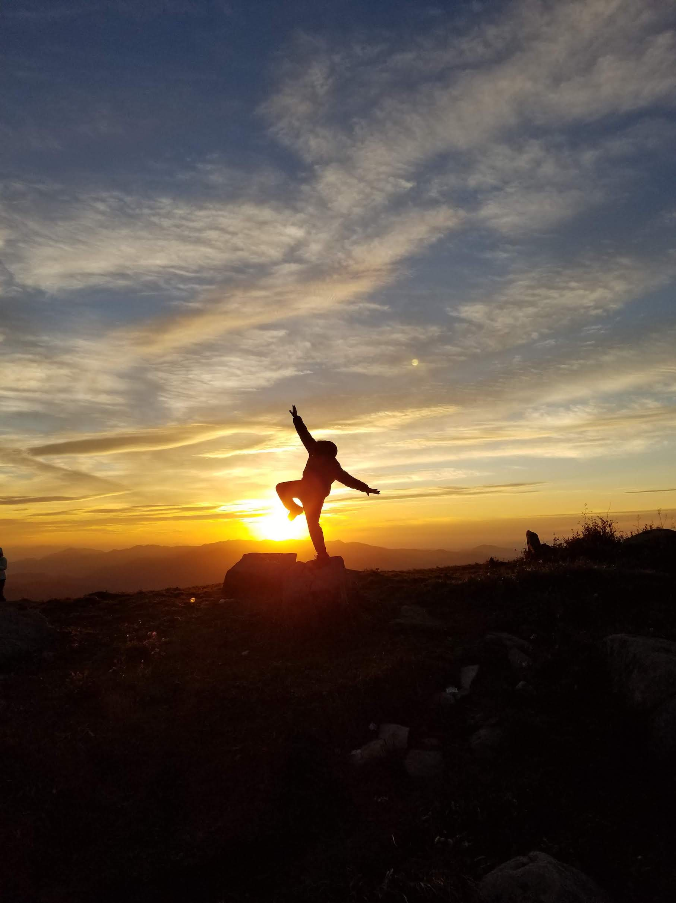

前几天和同事聊天，开玩笑说过去一年应该是我入行以来角色变化最多的一年。18年对我来说的确是值得记录一下，跳出了舒适圈，也学到了一些东西。

## 看过的书

今年没看啥书，而且大量都是半途而废，感觉大量的碎片时间都被我浪费了，值得反思。

#### [Python 机器学习及实践](https://book.douban.com/subject/26886337/)

年初机器学习的大热，未能免俗。从京东买了一本，大概每天抽出一个小时左右阅读，大概两个星期看完。

因为目标是弄懂大概的知识体系及算法大概，很多Task都没有实践，只在`pycharm`玩了玩。算是达成目标吧。

#### [阅微草堂笔记](https://book.douban.com/subject/1279132/)

大概春天的时候，和老婆去丈母娘家，收拾屋子的时候偶然翻出了一些书，随手拿了一本。没想到拿起后，就一直看了下去，大概看到了十七卷，完成了80%吧，目前也没看完。记得夏天的时候，我去北戴河clubmed也带着，秋天去英国也带着。

总体来说喜欢里面的一些`志怪`故事，可能之前看了小泉八云的《奇谭·怪谈》对这些志怪类的小故事比较感兴趣。

#### [用户思维+ （Badass - making users awesome）](https://book.douban.com/subject/27129563/)

年初的时候，因为工作中需要担任产品的角色，所以想改变一下思维方式。
也是在京东购买的，大概用了一周左右的时间来完成阅读。内容不太多，如果时间允许的话基本上可以一口气读完。

主要收获是两个方面：

1. 如何从用户角度出发看产品：成就用户
2. 如何更加高效引导用户：感性认知

#### [火星救援](https://book.douban.com/subject/26586492/)

同事推荐的书。虽然看过了电影，但是书里的语言幽默风趣，读的时候大脑再次加工比电影要丰富很多。

#### [重生](https://book.douban.com/subject/26910593/)

在机场接人，等待的时候在书店看到了，一看是史蒂芬·金的就买了一本。之前读过一本史蒂芬·金的短片小说集，感觉情节设计非常好，也很适合改编为电影。那本书中有个故事叫《尸体》记忆犹新，虽然没有他一贯的那么惊悚，但是给人感觉非常舒缓，后来找到改编的电影《Stand by Me》看了，电影没什么印象，倒是同名主题曲《Stand by Me》非常喜欢。

扯远了，回到这本书，整个故事感觉在前面留下悬念后一直在铺垫，而且特别的长，从主角的小时候到长大成家，最后的“重生”才把谜底揭开。总体上是对信仰的一些探讨，get不到太多点。

#### [算法](https://book.douban.com/subject/19952400/)

买来备查阅用，闲来无事复习了一些算法，不算完整看完过。

#### [大脑整理术](https://book.douban.com/subject/27079629/)

夏天的时候感觉大脑不够使，所以读了读，有很多生物学的术语都记不太清了，倒是养成了一些对大脑有益的饮食习惯。

#### [闪回：电影简史](https://book.douban.com/subject/10567711/)

龙叔说电影上推荐的，就买来看了看，主要在公司中午休息的时候阅读。了解了电影的起源，看到就1940年代就作罢了。完成30%左右，没有看完。

#### [如何欣赏一部电影](https://book.douban.com/subject/30177151/)

某个周末去了一趟三里屯，偶然逛了Page One书店，在书店里看到的书。当然还是回家在京东上买的。
像教材一样的书，完成30%，也没有看完。

## 技术上

Android方面除了参与了一些架构上的工作，就没有放太多精力，主要是在Review代码，或者阅读一些库的代码。诶，划水居多。

### 代码量

看图说话：比去年少了一些，主要因为年初到8月都在做产品相关的工作。

#### Flutter
一大概花了一天时间熟悉了一下语言，然后花了一周时间上手开始写。正好用来做一个新的小项目来试一下。

从提交第一行代码到提交AppStore算了一下大概花了21天，感觉对于简单项目来说Flutter是非常适合的。
因为刚开始写的时候，Flutter还是预览版，所以这期间当然也遇到了很多坑。以后再单开一个文章讨论一下Flutter吧。

 

#### 整理了之前一些技术分享

Deeplink相关和FFmpeg相关都发了[两篇专栏](https://juejin.im/user/56e22f327664bf0051838031/posts)到掘金上。

FFmpeg的貌似受大家关注更多，应该是18年短视频的火爆带起来了。而且因为这些专栏，认识了一些有趣的人，包括当时在[猫饼](http://maobing.tv/)工作的[光源](https://github.com/zhenghuiy)，交流了很多视频编辑的经验。

#### 参会

1. 5月去了Google，参加[线下Meetup](https://blog.zhoulujue.com/Google-Rising-Star-Meetup/)

2. 11月去了`安卓绿色联盟开发者大会`领了个绿色应用奖(大概是参与奖？)，也听了很多技术上的分享。

3. 12月又去了Google的线下Meetup，这次遇到很多出海应用的产品和技术，聊的很开心

## 生活上

### 旅行

1. 年初元旦期间去了海南，去海滩躺了几天很舒服。乘坐环岛高铁时，拍下了一个匆匆的身影

2. 6月去了青海，开车绕了青海湖半圈

3. 9月又去了一趟海坨山

4. 十一去了趟英国，主要在苏格兰高地附近撒野，下图是斯托尔老人岩。英国乡间开车真的太美了。

### 自省思考

因为今年在工作上作了若干个角色，开始思考自己的核心价值，意识到其实不管作什么我擅长的其实是**快速学习**，把不熟悉的事物分析清楚并尝试用自己的知识体系去理解，消化后内化为自己的一部分。

意识到自己在工作中的自我反馈。

之前作技术的时候，正反馈和负反馈来得都很快，一般以执行任务，解决问题为主。任务完成，问题解决，反馈就结束。

当输出决策的时候，这个反馈就会变得很长，决策要先形成需求，需求排队等待实现，实现完成等待上线，上线等到覆盖率饱和，这时候才会看到数据，数据给出正/负反馈。
一开始特别不适应，感觉工作起来好像没有成就感（其实是没有耐心或者不自信？），后来也就慢慢习惯了。

...

### 很多第一次

第一次和老婆去了一趟酒吧🍺

第一次骑马🐎

第一次作App实名备案，ICP实名备案📱

第一次听古典歌剧🎼

...

### 最后

本来想在元旦假期的年终总结，让我拖到现在总算了解了。希望19年能够少一些拖延吧😂

19年愿自己仍然保持对技术的好奇与热情。

