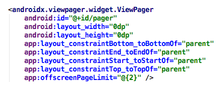
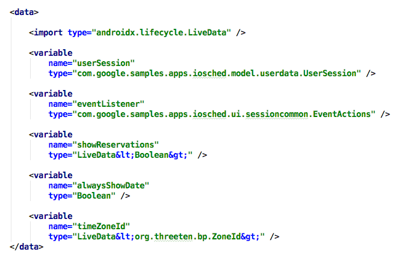
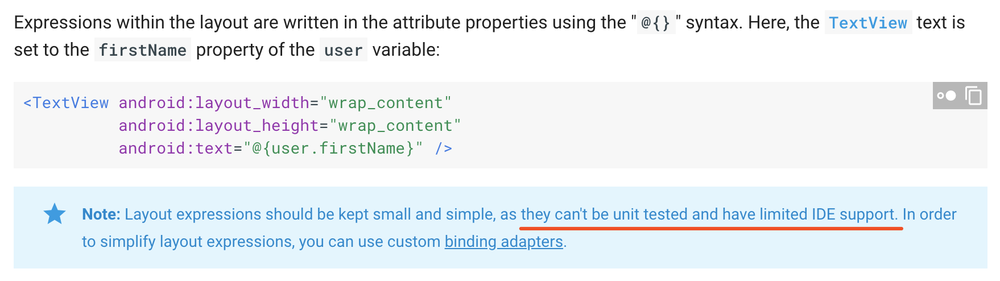
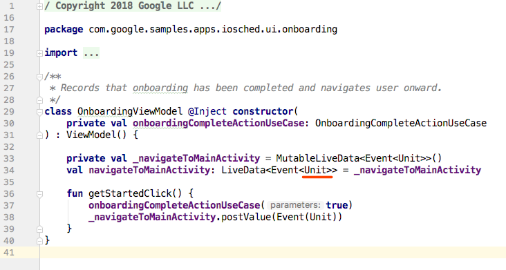
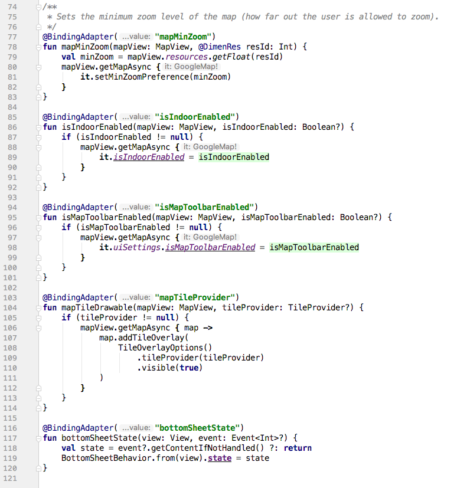

自从若干年前Databinding被引进后，很多人感觉看到了未来，Android的代码写起来更像前端的代码组合方式了。

然而，因为没有类似 webpack 的打包工具，Databinding将Java代码放到xml的做法始终没有Html配合JavaScript那么顺畅。

XML在Android的历史上有很长的时间被视为resource（到现在还被放到res/目录下），好在 AndroidStudio3.0.0后Google引进了`aapt2`，看起来要终结这个现象。
我们通过Google的`iosched`项目来看一下`DataBinding`的推荐用法。

## Something about AAPT - Android Asset Packaging Tool.
>
>XMLs are also code.
>

Aapt2 的设计方向：将 resources 视为代码，将错误提前。

早期的 aapt 在处理resources时，只是将 resource 做一下 indexing，生成 R.java，然后参与Gradle编译，runtime 加载

resource所以，以前经常出现的情况时，在XML里写了个错误的 property / attribute value，编译通过了，跑起来了，点到测试页面崩溃了。

如果你用过 aapt，它其实是没有 compile 这个命令的，Android Studio 或者 Apktool 打包时，都是用的 aapt package，也就是说，只有当 indexing 不了的时候才会出错。

现在 aapt2 提供了 compile 命令，也就是说 gradle 的 assembleReource 的 task 会执行 aapt2 的编译命令，如果你的XML有任何错误，编译时会提示你：例如，引用了不存在的 @string，@style，@drawable。

## namespace 

由于XML 的 namespace 没有严格区分，所以很难一眼看出哪个是 bind adapter 提供的 attribute 哪个不是所以使用时，一定要区分清楚，bind adapter 不要忘了 @{ }

---

## 不支持在type里声明<>

目前IDE及插件不能解决，写起来不太优雅只能通过代码规范来约束

---

## Binding Expression 的缺点

1. 漏写 @{}，aapt2 不会将这个 expression 识别为一个编译错误，只有当运行起来后才会报错，极有可能延迟错误的发生到 runtime。IDE对 binding expression 的支持是一个 limited support，也就是说不会有代码提示，错误提示等等，增加了犯错的几率。

Bindging expression 还有一个不算缺点的缺点：被限制只能写简单的逻辑。

它的设计目的是为了保证只依赖 <data> 声明的内容，从而使view的依赖单一。

首先第一个问题就是**事件**怎么用 <data> 描述，官方推荐的解决方案：LiveData<SomeEventType> eventEmitter

这样ViewModel里会多出来很多无用的 LiveData 即使这些 LiveData 没有装载任何Data，代码可读性不太高。

其实可以等效改为 typed EventBus 来解决，避免冗余的范型展开以及LiveData的状态管理

被限制只能写简单的逻辑，出发点是好的，但是随着业务的复杂化，attribute 的 value 很有可能不是简单的从 ViewModel 的 property/getter 获得，而是拥有了一些逻辑。

此时就要用到 BindingAdapter，通过在方法上添加 @BindingAdapter 来向某个 View 的 attribute 提供 value，也没问题。

问题是，这些方法你要放在哪里？官方推荐做法：放到一个同一个文件里。逻辑没有内聚：可以分门别类到不同的文件中来解决，最好放到 XXXView.java / XXXCell.java 里，如果需要复用，最好抽取 Base类，然后放到 Base类里

读代码时带来的困扰，无法F3和Find Usages：在XML里没有形成依赖，只能通过字符串查找。目前没有办法解决命名冲突：BindingAdapter的名称要用指定好的前缀来避免命名冲突

如果你的XML描述的 View 自治性很好，对外界的依赖很小，那么这种写法其实很好，因为xml中 <data> 对你的单依赖能很好的在 ViewModel 中内消化掉。但是如果你的XML描述的 View 对外界的依赖较高，要么添加更多 <data> 依赖，要么使用复杂的 binding adapter。违背了 DataBinding设计的初衷，所以请将你的XML描述的View的自治性设计的尽量好一些。